# Analyze Screenshots

Our app allows for easy import of screenshots from eBanking apps. The newly created ValueSnapshots have no data, just the screenshot.
Now we have imported the `ImageAnalysisService` that provides functionality to easily read images and identify data in images like screenshots.

We want to leverage this functionality to read out data from screenshots. Some thoughts:

* Scanning should automatically start when a new ValueSnapshot is created with a state that indicates it only holds an image.
* We need to rework the states and state transitions a ValueSnapshot can have. We probably want to identify
  * When scanning the screenshot should start
  * When a user looked at data - data validated by humans always overrides automatically extracted data
  * We also want to differentiate when data is based on automatic extraction and is complete / incomplete, but not yet human-reviewed
  * Data can be incomplete: For ex. the automatic extraction might have identified the value but not the date (we will implement that later) or the series to which it belongs (also later implementation).
  * When a ValueSnapshot is being auto-processed, so the UI can indicate it
  * When auto-extraction tried but failed - obviously we want to avoid a loop
  * Pls suggest states, state names and descriptions of the states as well as their transitions
* Scanning should always happen off the UI process so the UI remains responsive.
* Every change of a ValueSnapshot should of course be saved to CloudKit

## Proposed State Machine

### States

**`pendingAnalysis`**
- Initial state when a ValueSnapshot is created with only a screenshot
- Triggers automatic analysis
- UI: 
  - gray background
  - a small indicator that an image is attached on the right edge
  - a question mark symbol on the right edge

**`analyzing`**
- Analysis is currently in progress
- Prevents duplicate analysis attempts
- UI: 
  - gray background
  - a small indicator that an image is attached on the right edge
  - A spinner 
  - While being analyzed, the user cannot open the entry for editing.

**`analysisCompletePartial`**
- Analysis succeeded but extracted incomplete data
- E.g., found value but not date/series
- User can manually complete
- UI: 
  - gray background
  - a small indicator that an image is attached on the right edge
  - A symbol that indicates the "partial" idea

**`analysisCompleteFull`**
- Analysis succeeded and extracted all expected data (value, date, series)
- Allowing for human review/validation
- UI: 
  - light gray background
  - a small indicator that an image is attached on the right edge

**`analysisFailed`**
- Analysis attempted but failed to extract any useful data
- Does not automatically retry to prevent loops
- User can manually enter data
- UI: 
  - gray background
  - a small indicator that an image is attached on the right edge
  - a 2-question-marks symbol on the right edge

**`humanConfirmed`**
- User manually entered, edited, or validated data
- Covers three scenarios:
  - User manually entered all data from scratch
  - User edited auto-extracted data
  - User reviewed and confirmed auto-extracted data is correct
- Overrides any auto-extracted data
- Highest confidence level - human has verified the data
- Terminal state for data quality purposes
- UI: 
  - no background
  - a small indicator that an image is attached on the right edge, if it has an image

### State Transitions

```
pendingAnalysis → analyzing
  Trigger: Automatic on creation after a second (for more tangible state transition for the user)

analyzing → analysisCompleteFull
  Trigger: Successful extraction of all data (value, date, series)

analyzing → analysisCompletePartial
  Trigger: Successful extraction of some data (e.g., value only)

analyzing → analysisFailed
  Trigger: Error or no data extracted

analysisCompleteFull → humanConfirmed
  Trigger: User reviews and confirms data is correct

analysisCompletePartial → humanConfirmed
  Trigger: User completes missing fields, or edits and confirms

analysisFailed → humanConfirmed
  Trigger: User manually enters data
```

## Data Model Changes

### ValueSnapshot Enhancements

Add new properties to `ValueSnapshot.swift`:

```swift
// Analysis state
var analysisState: AnalysisState = .pendingAnalysis

// Store screenshot
var screenshotData: Data?

// Track what was auto-extracted vs human-provided
var valueSource: DataSource = .human
var dateSource: DataSource = .human
var seriesSource: DataSource = .human

// Analysis metadata
var analysisAttemptedAt: Date?
var analysisCompletedAt: Date?
var analysisError: String?
```

### New Enums

```swift
enum AnalysisState: String, Codable {
    case pendingAnalysis
    case analyzing
    case analysisCompleteFull
    case analysisCompletePartial
    case analysisFailed
    case humanConfirmed
}

enum DataSource: String, Codable {
    case robot      // Automatically extracted by image analysis
    case human      // Entered, edited, or implicitly confirmed by user
}
```

## Architecture

**Philosophy: Modern SwiftUI (No ViewModels)**

Following `BEST_PRACTICES_VIEW_MODELS.md`:
- ✅ Views observe SwiftData directly using `@Query`
- ✅ Services injected via `@Environment` for dependency injection
- ✅ Business logic in services, not ViewModels
- ✅ Views use `.task()` and `.onChange()` for side effects
- ✅ State lives in SwiftData models, not intermediate ViewModels
- ❌ No MVVM pattern - SwiftUI views are designed to be lightweight structs

### Component Structure

**ScreenshotAnalysisService**
- Service injected via `@Environment` for analyzing screenshots
- Uses existing `ImageAnalysisService` (already imported from Foundation-Models-Framework-Example)
- Extracts monetary values using priority-based text recognition
- Updates ValueSnapshot state directly via modelContext
- Uses @Observable for reactive state updates
- No ViewModels - views observe SwiftData directly with `@Query`

**Key Features from ImageAnalysisService:**
- Returns `TextRecognitionResult` with priority ranking (1 = highest importance)
- Confidence scores (0.0 to 1.0) for each recognized text
- Account balances typically appear as priority 1-2 (large, prominent text)
- Processing time: ~1-3 seconds on modern devices
- Automatic cleanup of temporary files

**View Integration (No ViewModels):**
- Views use `@Query` to observe ValueSnapshots directly
- `ScreenshotAnalysisService` injected via `@Environment`
- Views trigger analysis via `.task()` or `.onChange()` modifiers
- State transitions visible automatically through SwiftData observation

### Processing Flow

#### Flow Diagram

```mermaid
flowchart TD
    Start1[User Shares Screenshot<br/>from Photos/Banking App] --> ShareExt[Share Extension]
    Start2[User Taps Add in App] --> Picker[Photo Picker/Camera]

    ShareExt --> CreateSnap1[Create ValueSnapshot<br/>state: pendingAnalysis<br/>screenshotData: image]
    Picker --> CreateSnap2[Create ValueSnapshot<br/>state: pendingAnalysis<br/>screenshotData: image]

    CreateSnap1 --> SaveData1[Save to SwiftData<br/>App Group Container]
    CreateSnap2 --> SaveData2[Save to SwiftData]

    SaveData1 --> ShareDismiss[Share Extension Dismisses]
    ShareDismiss --> AppOpens{Main App<br/>Opens/Active?}
    AppOpens -->|No| CloudSync[CloudKit Syncs Data]
    AppOpens -->|Yes| Query1[Views Observe via @Query]
    CloudSync --> Query1

    SaveData2 --> Query2[Views Observe via @Query]

    Query1 --> TaskTrigger[.task detects pendingAnalysis]
    Query2 --> TaskTrigger

    TaskTrigger --> CallService[await analysisService.analyzeSnapshot]

    CallService --> UpdateAnalyzing[Update state: analyzing<br/>Show spinner in UI]
    UpdateAnalyzing --> CallVision[Call ImageAnalysisService.analyze]

    CallVision --> VisionProcess[Vision Framework<br/>Text Recognition<br/>1-3 seconds]

    VisionProcess --> ParseResults[Parse TextRecognitionResults<br/>Filter priority 1-3, confidence > 0.8]

    ParseResults --> CheckValue{Monetary<br/>Value Found?}

    CheckValue -->|Yes| Success[Update ValueSnapshot:<br/>- value = extractedValue<br/>- valueSource = robot<br/>- state = analysisCompleteFull]
    CheckValue -->|No| Failure[Update ValueSnapshot:<br/>- state = analysisFailed<br/>- analysisError = message]

    Success --> SaveChanges[Save to SwiftData]
    Failure --> SaveChanges

    SaveChanges --> UIUpdate[SwiftUI Reactively Updates<br/>Background color, icons]

    UIUpdate --> UserOpens{User Opens<br/>for Editing?}

    UserOpens -->|Yes| Confirm[Transition to humanConfirmed<br/>robot → human sources]
    UserOpens -->|No| Wait[Wait for user action]

    Confirm --> FinalState[Terminal State:<br/>humanConfirmed]

    style ShareExt fill:#e1f5ff
    style Picker fill:#e1f5ff
    style CallVision fill:#fff4e1
    style VisionProcess fill:#fff4e1
    style Success fill:#e8f5e9
    style Failure fill:#ffebee
    style FinalState fill:#f3e5f5
```



#### Entry Points for Screenshot Import

**A. Share Extension (Primary Flow)**
1. User shares screenshot to Summa from Photos/Banking app
2. ShareExtension receives image via `NSExtensionItem`
3. ShareExtension creates ValueSnapshot:
   - `analysisState = .pendingAnalysis`
   - `screenshotData = imageData`
   - `value = 0.0` (placeholder)
   - `date = Date()`
   - `series = lastUsedSeries ?? defaultSeries`
4. Save to shared SwiftData container (with App Group)
5. ShareExtension dismisses
6. Main app observes new snapshot via `@Query` (CloudKit sync if needed)
7. Auto-triggers analysis when app opens

**B. In-App Import (Photo Picker / Camera)**
1. User taps add button in main app
2. Photo picker or camera presents
3. User selects/captures screenshot
4. Creates ValueSnapshot with same pattern as Share Extension
5. Immediate analysis trigger (app is already open)

#### Analysis Flow (Same for Both Entry Points)

1. **Automatic Analysis Trigger**
   - View observes ValueSnapshots via `@Query`
   - Detects `pendingAnalysis` state via `.task(id: snapshot.analysisState)`
   - Calls `ScreenshotAnalysisService` from `@Environment`
   - Service updates state to `analyzing`

3. **Background Analysis**
   - ScreenshotAnalysisService calls `ImageAnalysisService.analyze(image:)`
   - Gets `TextRecognitionResult` array sorted by priority
   - Extracts monetary values from high-confidence text (confidence > 0.8)
   - Focuses on priority 1-3 results (most prominent text)
   - Uses regex to parse currency formats (handles $, €, CHF, etc.)

4. **Result Handling**
   - On main thread, update ValueSnapshot with results
   - Set appropriate state (completeFull/Partial/Failed)
   - Update `*Source` properties to indicate auto-extraction
   - Save changes to SwiftData (auto-syncs to CloudKit)

5. **UI Updates**
   - SwiftUI `@Query` automatically reflects changes
   - Show appropriate indicators based on state
   - Present validation/edit UI for user review

6. **User Validation**
   - When user opens edit view for a ValueSnapshot with robot-sourced data:
     - All fields automatically change from `DataSource.robot` to `DataSource.human`
     - State transitions to `humanConfirmed`
     - This implicit confirmation means user has reviewed the data
   - User can then edit any fields as needed
   - Changes persist to CloudKit

### Background Processing

**Important: No Task.detached Needed**

Following `BEST_PRACTICE_ASYNC_INSIDE_TASK.md`:
- ✅ `ImageAnalysisService.analyze()` is already `@MainActor` and async
- ✅ Vision framework internally handles background processing
- ✅ Processing takes 1-3 seconds - not heavy enough to need `Task.detached`
- ✅ Views use `.task {}` which automatically provides async context
- ✅ Always use `await` when calling async functions
- ❌ No need for `Task.detached` - would add unnecessary complexity

### Service Implementation

**ScreenshotAnalysisService.swift** (injected via @Environment):

```swift
import Foundation
import SwiftData

@Observable
@MainActor
final class ScreenshotAnalysisService {
    private let imageAnalysis = ImageAnalysisService()

    func analyzeSnapshot(_ snapshot: ValueSnapshot, modelContext: ModelContext) async {
        // Update to analyzing state
        snapshot.analysisState = .analyzing
        snapshot.analysisAttemptedAt = Date()
        try? modelContext.save()

        // Load image from screenshotData
        guard let imageData = snapshot.screenshotData,
              let image = UIImage(data: imageData) else {
            snapshot.analysisState = .analysisFailed
            snapshot.analysisError = "Could not load screenshot"
            try? modelContext.save()
            return
        }

        // ImageAnalysisService.analyze is already @MainActor
        await imageAnalysis.analyze(image: image)

        // Extract monetary value from results
        guard let textResults = imageAnalysis.analyzedImage?.textResults else {
            snapshot.analysisState = .analysisFailed
            snapshot.analysisError = "No text detected"
            try? modelContext.save()
            return
        }

        // Find most prominent numeric value (priority 1-3, confidence > 0.8)
        let monetaryValue = extractMonetaryValue(from: textResults)

        if let value = monetaryValue {
            snapshot.value = value
            snapshot.valueSource = .robot
            snapshot.analysisState = .analysisCompleteFull
            snapshot.analysisCompletedAt = Date()
        } else {
            snapshot.analysisState = .analysisFailed
            snapshot.analysisError = "No monetary value found"
        }

        try? modelContext.save()
    }

    // MARK: - Configurable Detection Parameters

    /// Weights for scoring monetary value candidates
    /// These can be tuned to improve detection accuracy
    struct DetectionWeights {
        let priorityWeight: Double = 0.4      // Importance of text size/prominence
        let confidenceWeight: Double = 0.3    // Importance of OCR confidence
        let currencySymbolWeight: Double = 0.2 // Bonus for having currency symbol
        let formatWeight: Double = 0.1        // Bonus for proper number format

        // Thresholds
        let minConfidence: Float = 0.75       // Minimum OCR confidence
        let maxPriority: Int = 3              // Only consider top 3 priority levels
        let minScore: Double = 0.6            // Minimum combined score to accept
    }

    private let weights = DetectionWeights()

    private func extractMonetaryValue(from results: [TextRecognitionResult]) -> Double? {
        // Score and rank all candidates
        let candidates = results
            .compactMap { result -> (value: Double, score: Double, result: TextRecognitionResult)? in
                guard let value = parseCurrencyString(result.text) else { return nil }
                let score = calculateScore(for: result, value: value)
                return (value, score, result)
            }
            .filter { $0.score >= weights.minScore }
            .sorted { $0.score > $1.score }

        // Return highest scoring candidate
        return candidates.first?.value
    }

    private func calculateScore(for result: TextRecognitionResult, value: Double) -> Double {
        var score = 0.0

        // 1. Priority Score (0-1, lower priority number = higher score)
        // Priority 1 = 1.0, Priority 2 = 0.66, Priority 3 = 0.33
        let priorityScore = result.priority <= weights.maxPriority
            ? max(0, 1.0 - (Double(result.priority - 1) / Double(weights.maxPriority)))
            : 0.0
        score += priorityScore * weights.priorityWeight

        // 2. Confidence Score (0-1)
        let confidenceScore = result.confidence >= weights.minConfidence
            ? Double(result.confidence)
            : 0.0
        score += confidenceScore * weights.confidenceWeight

        // 3. Currency Symbol Bonus (0-1)
        let hasCurrencySymbol = detectsCurrencySymbol(result.text)
        score += (hasCurrencySymbol ? 1.0 : 0.0) * weights.currencySymbolWeight

        // 4. Format Score (0-1)
        let formatScore = assessNumberFormat(result.text)
        score += formatScore * weights.formatWeight

        return score
    }

    private func detectsCurrencySymbol(_ text: String) -> Bool {
        let currencySymbols = ["$", "€", "£", "¥", "₹", "₽", "¢", "₣", "₤", "₧", "CHF", "USD", "EUR", "GBP"]
        return currencySymbols.contains { text.contains($0) }
    }

    private func assessNumberFormat(_ text: String) -> Double {
        // Higher score for well-formatted numbers
        var score = 0.0

        // Has thousands separator
        if text.contains(",") || text.contains("'") || text.contains(".") {
            score += 0.3
        }

        // Has decimal separator
        let hasDecimal = text.range(of: #"[.,]\d{2}$"#, options: .regularExpression) != nil
        if hasDecimal {
            score += 0.4
        }

        // Reasonable length (not too short, not too long)
        let digitCount = text.filter { $0.isNumber }.count
        if digitCount >= 3 && digitCount <= 12 {
            score += 0.3
        }

        return min(score, 1.0)
    }

    private func parseCurrencyString(_ text: String) -> Double? {
        // Currency parsing logic from ImageAnalysisService-Usage.md
        // Handles various formats:
        // - "12.34", "12,34" (simple decimals)
        // - "1,234.56" (US format)
        // - "1.234,56" (European format)
        // - "1'234.56" (Swiss format)
        // - "$1,234.56", "1'234.56 CHF", "€ 1.234,56"

        var cleaned = text

        // Remove currency symbols
        cleaned = cleaned.replacingOccurrences(
            of: #"[$€£¥₹₽¢₣₤₧₨₩₪₫₱₡₨₭₮₴₵₸₹₺₼₽₾₿]"#,
            with: "",
            options: .regularExpression
        )

        // Remove common currency codes
        cleaned = cleaned.replacingOccurrences(
            of: #"\b(USD|EUR|GBP|CHF|JPY|CNY|CAD|AUD)\b"#,
            with: "",
            options: .regularExpression
        )

        // Trim whitespace
        cleaned = cleaned.trimmingCharacters(in: .whitespaces)

        // Detect decimal separator (last . or ,)
        let lastDot = cleaned.lastIndex(of: ".")
        let lastComma = cleaned.lastIndex(of: ",")

        // Handle European format (1.234,56) vs US format (1,234.56)
        if let comma = lastComma, let dot = lastDot {
            if comma > dot {
                // European format: dots are thousands, comma is decimal
                cleaned = cleaned.replacingOccurrences(of: ".", with: "")
                cleaned = cleaned.replacingOccurrences(of: "'", with: "")
                cleaned = cleaned.replacingOccurrences(of: ",", with: ".")
            } else {
                // US format: commas are thousands, dot is decimal
                cleaned = cleaned.replacingOccurrences(of: ",", with: "")
                cleaned = cleaned.replacingOccurrences(of: "'", with: "")
            }
        } else if lastComma != nil {
            // Only comma present - check if it's decimal or thousands
            let commaPos = cleaned.distance(from: cleaned.startIndex, to: lastComma!)
            let afterComma = cleaned.distance(from: lastComma!, to: cleaned.endIndex) - 1

            if afterComma == 2 {
                // Likely decimal (e.g., "1234,56")
                cleaned = cleaned.replacingOccurrences(of: "'", with: "")
                cleaned = cleaned.replacingOccurrences(of: ",", with: ".")
            } else {
                // Likely thousands separator
                cleaned = cleaned.replacingOccurrences(of: ",", with: "")
                cleaned = cleaned.replacingOccurrences(of: "'", with: "")
            }
        } else {
            // Only dots or no separators - remove apostrophes (Swiss)
            cleaned = cleaned.replacingOccurrences(of: "'", with: "")
        }

        // Keep only digits, dot, and negative sign
        cleaned = cleaned.replacingOccurrences(
            of: #"[^0-9.-]"#,
            with: "",
            options: .regularExpression
        )

        return Double(cleaned)
    }
}
```

### Monetary Value Detection Algorithm

**Multi-Criteria Scoring System**

The algorithm uses a weighted scoring approach to rank all detected numeric values and select the most likely account balance:

#### Scoring Criteria (Total = 1.0)

1. **Priority Score (40%)** - Based on text size/prominence
   - Priority 1 (largest text): 1.0
   - Priority 2: 0.66
   - Priority 3: 0.33
   - Priority 4+: Excluded

2. **Confidence Score (30%)** - OCR recognition confidence
   - Uses Vision framework confidence (0.0-1.0)
   - Minimum threshold: 0.75
   - Higher confidence = higher score

3. **Currency Symbol Bonus (20%)** - Has $ € £ CHF etc.
   - Present: 1.0
   - Absent: 0.0

4. **Format Score (10%)** - Number formatting quality
   - Has thousands separator: +0.3
   - Has decimal (.XX or ,XX): +0.4
   - Reasonable length (3-12 digits): +0.3
   - Max: 1.0

#### Minimum Score Threshold: 0.6

Only candidates scoring ≥ 0.6 are considered. The highest scoring candidate wins.

#### Example Scoring

**Screenshot with:**
- "CHF 12'345.67" (Priority 1, Confidence 0.92)
- "Date: 31.12.2024" (Priority 2, Confidence 0.88)
- "Transaction: 45.00" (Priority 3, Confidence 0.95)

**Candidate 1: "CHF 12'345.67"**
- Priority: 1.0 × 0.4 = 0.40
- Confidence: 0.92 × 0.3 = 0.276
- Currency: 1.0 × 0.2 = 0.20
- Format: 1.0 × 0.1 = 0.10 (has thousands, decimal, good length)
- **Total: 0.976** ✅ Winner!

**Candidate 2: "31.12.2024" (date, not money)**
- Priority: 0.66 × 0.4 = 0.264
- Confidence: 0.88 × 0.3 = 0.264
- Currency: 0.0 × 0.2 = 0.0
- Format: 0.7 × 0.1 = 0.07 (has separators)
- **Total: 0.598** ❌ Below threshold

**Candidate 3: "45.00"**
- Priority: 0.33 × 0.4 = 0.132
- Confidence: 0.95 × 0.3 = 0.285
- Currency: 0.0 × 0.2 = 0.0
- Format: 0.7 × 0.1 = 0.07
- **Total: 0.487** ❌ Below threshold

#### Tuning the Algorithm

**All weights are in `DetectionWeights` struct** for easy experimentation:

```swift
struct DetectionWeights {
    let priorityWeight: Double = 0.4      // Adjust if text size matters more/less
    let confidenceWeight: Double = 0.3    // Adjust for OCR trust level
    let currencySymbolWeight: Double = 0.2 // Adjust currency symbol importance
    let formatWeight: Double = 0.1        // Adjust format matching importance

    let minConfidence: Float = 0.75       // Raise to be more strict
    let maxPriority: Int = 3              // Lower to only consider larger text
    let minScore: Double = 0.6            // Raise to reduce false positives
}
```

**Tuning Strategy:**
1. Test with diverse banking app screenshots
2. Adjust weights based on failure patterns
3. If too many false positives: Raise `minScore` or `minConfidence`
4. If missing balances: Lower thresholds or increase `priorityWeight`
5. Track accuracy metrics to measure improvements

#### Supported Number Formats

- **US**: `1,234.56`, `$1,234.56`
- **European**: `1.234,56`, `€ 1.234,56`
- **Swiss**: `1'234.56`, `1'234.56 CHF`
- **Simple**: `1234.56`, `1234,56`
- **With Currency**: `$12.34`, `€12,34`, `12.34 USD`

### View Integration (No ViewModels!)

**ContentView.swift** - Direct SwiftData observation:

```swift
struct ContentView: View {
    @Query private var snapshots: [ValueSnapshot]
    @Environment(\.modelContext) private var modelContext
    @Environment(ScreenshotAnalysisService.self) private var analysisService

    var body: some View {
        List(snapshots) { snapshot in
            ValueSnapshotRow(snapshot: snapshot)
                .task(id: snapshot.analysisState) {
                    // ✅ .task {} automatically provides async context
                    // ✅ Always use await for async functions
                    if snapshot.analysisState == .pendingAnalysis {
                        await analysisService.analyzeSnapshot(snapshot, modelContext: modelContext)
                    }
                }
        }
    }
}
```

**ValueSnapshotRow.swift** - View state based on model state:

```swift
struct ValueSnapshotRow: View {
    let snapshot: ValueSnapshot

    var body: some View {
        HStack {
            Text(snapshot.value, format: .currency(code: "USD"))

            Spacer()

            // UI indicators based on state
            switch snapshot.analysisState {
            case .pendingAnalysis:
                Image(systemName: "questionmark.circle")
            case .analyzing:
                ProgressView()
            case .analysisCompletePartial:
                Image(systemName: "exclamationmark.triangle")
            case .analysisCompleteFull, .analysisFailed:
                EmptyView()
            case .humanConfirmed:
                if snapshot.screenshotData != nil {
                    Image(systemName: "photo")
                }
            }
        }
        .background(backgroundColor)
    }

    private var backgroundColor: Color {
        switch snapshot.analysisState {
        case .pendingAnalysis, .analyzing, .analysisCompletePartial, .analysisFailed:
            return .gray.opacity(0.2)
        case .analysisCompleteFull:
            return .gray.opacity(0.1)
        case .humanConfirmed:
            return .clear
        }
    }
}
```

### Service Registration

**SummaApp.swift**:

```swift
@main
struct SummaApp: App {
    let modelContainer: ModelContainer
    @State private var analysisService = ScreenshotAnalysisService()

    var body: some Scene {
        WindowGroup {
            ContentView()
                .modelContainer(modelContainer)
                .environment(analysisService)
        }
    }
}
```

### Manual Retry Pattern (Button Action)

**Example: Retry button for failed analysis**:

```swift
struct ValueSnapshotDetailView: View {
    let snapshot: ValueSnapshot
    @Environment(\.modelContext) private var modelContext
    @Environment(ScreenshotAnalysisService.self) private var analysisService

    var body: some View {
        VStack {
            if snapshot.analysisState == .analysisFailed {
                Button("Retry Analysis") {
                    // ✅ Task {} bridges from sync (button action) to async
                    // ✅ Always use await inside Task
                    Task {
                        await analysisService.analyzeSnapshot(snapshot, modelContext: modelContext)
                    }
                }
            }
        }
    }
}
```

**Note:** `.task {}` modifier is preferred over `onAppear { Task {} }` because:
- `.task {}` automatically cancels when view disappears
- `.task {}` can track dependencies with `id:` parameter
- Cleaner, more declarative syntax

### Share Extension Implementation

**ShareViewController.swift** (simplified example):

```swift
import UIKit
import SwiftData
import UniformTypeIdentifiers

class ShareViewController: UIViewController {
    private var modelContainer: ModelContainer!

    override func viewDidLoad() {
        super.viewDidLoad()

        // Initialize shared ModelContainer with App Group
        do {
            let appGroupID = "group.com.yourcompany.summa"
            let containerURL = FileManager.default
                .containerURL(forSecurityApplicationGroupIdentifier: appGroupID)!
                .appendingPathComponent("Summa.sqlite")

            let config = ModelConfiguration(url: containerURL)
            modelContainer = try ModelContainer(
                for: ValueSnapshot.self, Series.self,
                configurations: config
            )
        } catch {
            // Handle error
            dismissWithError()
            return
        }

        // Extract image from share items
        Task {
            await handleSharedItems()
        }
    }

    @MainActor
    private func handleSharedItems() async {
        guard let extensionItem = extensionContext?.inputItems.first as? NSExtensionItem,
              let itemProvider = extensionItem.attachments?.first else {
            dismissWithError()
            return
        }

        // Check if it's an image
        guard itemProvider.hasItemConformingToTypeIdentifier(UTType.image.identifier) else {
            dismissWithError()
            return
        }

        do {
            // Load image data
            let data = try await itemProvider.loadItem(
                forTypeIdentifier: UTType.image.identifier,
                options: nil
            )

            guard let url = data as? URL,
                  let imageData = try? Data(contentsOf: url) else {
                dismissWithError()
                return
            }

            // Create ValueSnapshot with pending analysis state
            let modelContext = ModelContext(modelContainer)
            let series = getLastUsedSeries(context: modelContext)

            let snapshot = ValueSnapshot(
                value: 0.0,  // Placeholder - will be filled by analysis
                date: Date(),
                notes: "Imported from screenshot",
                series: series
            )
            snapshot.analysisState = .pendingAnalysis
            snapshot.screenshotData = imageData
            snapshot.valueSource = .robot  // Will be analyzed

            modelContext.insert(snapshot)
            try modelContext.save()

            // Dismiss successfully
            extensionContext?.completeRequest(returningItems: [], completionHandler: nil)

        } catch {
            dismissWithError()
        }
    }

    private func getLastUsedSeries(context: ModelContext) -> Series {
        // Retrieve last used series or default series
        // Similar to SeriesManager.getLastUsedSeries()
        let descriptor = FetchDescriptor<Series>(
            sortBy: [SortDescriptor(\.sortOrder)]
        )
        let series = try? context.fetch(descriptor).first
        return series ?? createDefaultSeries(context: context)
    }

    private func createDefaultSeries(context: ModelContext) -> Series {
        let series = Series(name: "Default", colorHex: "#007AFF", sortOrder: 0)
        context.insert(series)
        return series
    }

    private func dismissWithError() {
        let error = NSError(domain: "SummaShareExtension", code: -1)
        extensionContext?.cancelRequest(withError: error)
    }
}
```

**Key Share Extension Requirements:**

1. **App Group Configuration**:
   - Enable App Groups capability in both main app and extension
   - Share identifier (e.g., `group.com.yourcompany.summa`)
   - SwiftData container must use shared App Group URL

2. **Info.plist Configuration**:
   ```xml
   <key>NSExtension</key>
   <dict>
       <key>NSExtensionActivationRule</key>
       <dict>
           <key>NSExtensionActivationSupportsImageWithMaxCount</key>
           <integer>1</integer>
       </dict>
       <key>NSExtensionPointIdentifier</key>
       <string>com.apple.share-services</string>
   </dict>
   ```

3. **Entitlements**:
   - Both targets need App Groups entitlement
   - Both targets need iCloud/CloudKit entitlement for sync

4. **Important Limitations**:
   - Share extensions have strict memory limits (~120MB)
   - **DO NOT run image analysis in the extension** (too heavy, will crash)
   - Only create the ValueSnapshot with `pendingAnalysis` state
   - Main app handles analysis when it opens/syncs

### Async/Await Best Practices Summary

Following `BEST_PRACTICE_ASYNC_INSIDE_TASK.md`:

**✅ Correct Patterns Used:**
1. **Service method is async**: `func analyzeSnapshot(...) async`
2. **Views use .task {}**: Automatic async context, cancellation support
3. **Always await async calls**: `await analysisService.analyzeSnapshot(...)`
4. **Task for button actions**: Bridges sync → async correctly
5. **@MainActor service**: All UI updates safe by default

**❌ Patterns We Avoid:**
1. No `Task.detached` - unnecessary for 1-3 second operations
2. No missing `await` - prevents race conditions
3. No `Task {}` without `await` inside - would cause silent failures
4. No blocking operations on MainActor - Vision handles threading

**Why This Works:**
- `ImageAnalysisService.analyze()` is `@MainActor` and async
- Vision framework internally dispatches heavy work off main thread
- SwiftData automatically syncs changes to CloudKit
- Views reactively update when model state changes

### CloudKit Sync Considerations

- All state changes saved via SwiftData automatically sync
- `screenshotData` stored as `Data` type (CloudKit supports binary data)
- Consider size limits: CloudKit has 1MB asset limit per field
- For larger screenshots, may need CloudKit Asset reference instead
- Conflict resolution: manual/validated data should win over auto-extracted

## Implementation Plan

### Phase 1: State Machine & Data Model
1. Add `AnalysisState` and `DataSource` enums
2. Update `ValueSnapshot` model with new properties
3. Ensure CloudKit schema migration handles new fields
4. Add optional defaults for backward compatibility (`humanConfirmed` for existing snapshots)
5. Test data migration with existing ValueSnapshots

### Phase 2: Core Analysis Service
1. Create `ScreenshotAnalysisService` service (not ViewModel!)
2. Implement `analyzeSnapshot()` async method
3. Integrate existing `ImageAnalysisService` for text extraction
4. **Implement multi-criteria scoring algorithm**:
   - Create `DetectionWeights` struct with configurable weights
   - Implement `calculateScore()` with priority, confidence, currency, format criteria
   - Implement `assessNumberFormat()` for format quality scoring
   - Implement `detectsCurrencySymbol()` for currency detection
5. Add comprehensive currency parsing logic:
   - Handle US format (1,234.56)
   - Handle European format (1.234,56)
   - Handle Swiss format (1'234.56)
   - Detect decimal separator intelligently
6. Implement state transition logic
7. Add error handling with descriptive messages

### Phase 3: UI Integration (No ViewModels)
1. Inject `ScreenshotAnalysisService` via `@Environment` in app root
2. Add `.task(id:)` modifier to auto-trigger analysis on `pendingAnalysis` state
3. Update `ValueSnapshotRow` to show state-based UI:
   - Background colors (gray for pending/analyzing/partial/failed, light gray for full, clear for confirmed)
   - Icons (question mark, spinner, exclamation, photo indicator)
4. Modify edit view to transition robot → human on open
5. Add retry button for failed analyses

### Phase 4: Share Extension
1. Create Share Extension target in Xcode
2. Configure App Groups for shared SwiftData container
3. Implement `ShareViewController` to:
   - Accept image from share sheet
   - Create ValueSnapshot with `pendingAnalysis` state
   - Save to shared SwiftData container
   - Dismiss quickly (no analysis in extension!)
4. Update main app `ModelConfiguration` to use App Group URL
5. Test Share Extension → main app data flow
6. Test CloudKit sync when app is not running

### Phase 5: Testing & Edge Cases
1. Test Share Extension memory limits with large images
2. Test CloudKit sync conflicts (analysis on one device, manual edit on another)
3. Test app termination during analysis (should resume on relaunch)
4. Test multiple pending analyses queued
5. Test screenshot compression for CloudKit 1MB limit
6. Add unit tests for currency parsing logic
7. Add integration tests for analysis service

### Phase 6: Advanced Features (Optional)
1. Implement smart series detection (pattern matching on notes/extracted text)
2. Add date extraction from screenshots
3. Support batch screenshot import from Share Extension
4. Add analysis history/debug view with confidence scores
5. Implement screenshot retention policy (auto-delete after confirmation)

## Open Questions & Aspects

### Technical Questions

**Q1: Screenshot Storage Size**
- How large are typical banking screenshots?
- Should we compress images before storing?
- Do we need CloudKit Assets instead of Data type?
- Should we keep original or processed/optimized version?

**Q2: Analysis Accuracy & Confidence**
- Should we log all candidates with scores for debugging/tuning?
- How do we handle ambiguous extractions when scores are very close (e.g., 0.85 vs 0.82)?
- Should we present top N candidates to user for selection if multiple score highly?
- What's the threshold for partial vs failed analysis?
- Should we store the detection score with the ValueSnapshot for future analysis?
- How do we collect feedback to improve weights over time (ML training data)?

**Q3: Retry Strategy**
- Should failed analyses automatically retry after a delay?
- How many retry attempts before giving up?
- Should we use exponential backoff?
- What triggers a manual retry vs automatic?

**Q4: CloudKit Sync Conflicts**
- What if analysis completes on one device while user manually edits on another?
- Should `humanConfirmed` state always win conflicts over auto-extracted states?
- How do we handle concurrent analysis attempts across devices?

**Q5: Share Extension Flow**
- Should Share Extension show a preview/confirmation UI before saving?
- How do we handle multiple screenshots shared at once?
- Should user be able to select series in Share Extension, or always use default?
- What if Share Extension is invoked when app is not running - how quickly does analysis happen?
- Should we show a notification when analysis completes (for Share Extension imports)?

### UX/UI Questions

**Q6: User Feedback**
- What does "analyzing" state look like in UI?
- Should we show progress percentage or just spinner?
- How do we guide users to validate data?
- What visual indicators distinguish auto vs manual data?

**Q7: Validation Workflow**
- Implicit validation: Opening edit view = human confirmation (changes DataSource to human)
- Should we show a brief message explaining this implicit confirmation?
- For partial data, should opening edit view still require completing missing fields?
- Is there any scenario where we'd want explicit "Confirm" button instead?

**Q8: Error Handling**
- How do we explain analysis failures to users?
- Should we show technical errors or generic messages?
- What fallback actions do we offer?
- Should failed snapshots be easily filterable/manageable?

### Product Questions

**Q9: Privacy & Data**
- Should users opt-in to screenshot analysis? (analysis is on-device, no cloud processing)
- Should screenshots be deletable after successful extraction?
- Storage: Financial screenshots synced via CloudKit (encrypted by default)
- Should we add explicit privacy notice about screenshot storage in iCloud?

**Q10: Future Enhancements**
- Should we support batch screenshot import?
- Could we pre-train or improve accuracy over time per user?
- Should we support templates for common banking apps?
- Could we extract account names for auto-series mapping?

**Q11: Data Migration**
- How do we handle existing ValueSnapshots without screenshots?
- Should old snapshots default to `humanConfirmed` state (since they were manually entered)?
- Do we need to backfill states for existing data?

**Q12: Testing Strategy**
- How do we test different banking app screenshot formats?
- Should we build a test suite of sample screenshots?
- How do we simulate analysis errors in tests?
- Can we mock ImageAnalysisService for unit tests?

## Dependencies

- **ImageAnalysisService**: ✅ Already imported from Foundation-Models-Framework-Example
  - Located in `Summa/Services/ImageAnalysis/`
  - Uses Vision framework for text recognition
  - Returns priority-ranked results with confidence scores
  - See `ImageAnalysisService-Usage.md` for full API documentation
- **Swift Concurrency**: ✅ For async/await (ImageAnalysisService already uses @MainActor)
- **@Observable macro**: ✅ Already used by ImageAnalysisService (iOS 17+)
- **SwiftData**: ✅ Existing, for persistence
- **CloudKit**: ✅ Existing, for sync
- **Vision framework**: ✅ Already linked (used by ImageAnalysisService)
- **App Groups**: ⚠️ **Required for Share Extension** - enables shared SwiftData container
  - Must be configured in Xcode capabilities for both main app and extension
  - Use identifier like `group.com.yourcompany.summa`
- **Share Extension Target**: ⚠️ **New target needed**
  - iOS App Extension
  - Info.plist configured for image sharing
  - Entitlements for App Groups + iCloud
- **BackgroundTasks**: ❌ Not needed - analysis completes in 1-3 seconds

## Security & Privacy Considerations

1. **Sensitive Data**: Screenshots contain financial information
   - ✅ Vision framework processes images **entirely on-device** (no cloud processing)
   - ✅ CloudKit encryption is enabled by default for iCloud sync
   - CloudKit stores encrypted screenshot data securely
   - Consider: Add Face ID/Touch ID before viewing screenshots?

2. **Data Retention**:
   - Should screenshots auto-delete after successful extraction + validation?
   - Provide user control over screenshot retention policy
   - Consider storage quota implications

3. **iCloud Sync**:
   - Financial screenshots syncing across devices
   - User should be aware and consent
   - Consider opt-out option for screenshot sync (snapshots sync, images don't)

## Success Metrics

- **Accuracy Rate**: % of analyses that extract correct value
- **Completeness Rate**: % of analyses that extract all fields
- **Validation Rate**: % of users who validate vs manually edit
- **Time Savings**: Reduction in manual entry time
- **Error Recovery**: % of failed analyses successfully retried
