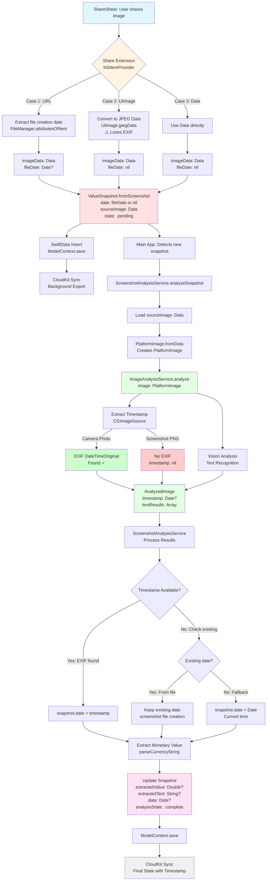

# Get Timestamp from Picture

Currently when creating a new ValueSnapshot based on a picture sent through the ShareSheet, we use the current date & time as time for the ValueSnapshot. We should rather use the date of the picture. The timestamp is encoded in the image metadata (EXIF data or file creation date).

## Current Implementation

**Share Extension** (`ShareViewController.swift:123`):

```swift
let snapshot = ValueSnapshot.fromScreenshot(imageData, date: Date())  // ← Uses current time
```

**Analysis Service** (`ScreenshotAnalysisService.swift:40`):

```swift
func analyzeSnapshot(_ snapshot: ValueSnapshot, modelContext: ModelContext) async {
    // Analyzes image for monetary value
    // Does NOT extract timestamp
}
```

The Share Extension creates snapshots with `Date()` (current time), and the analysis service extracts monetary values but ignores image metadata timestamps.

## Problem Statement

**Why this matters:**

- Users may share screenshots hours/days after they were taken
- Historical tracking becomes inaccurate
- User has to manually adjust the date in the app (extra friction)

**Example scenario:**

1. User takes screenshot of bank balance on Monday at 9 AM
2. User shares it to Summa on Tuesday at 5 PM
3. Snapshot is recorded as Tuesday 5 PM (incorrect)
4. User must manually edit to Monday 9 AM

## Solution: Parallel Extraction Pattern

**Key insight:** Extract timestamp during image analysis, just like we extract monetary value.

**Architecture:** Mirror the existing monetary value extraction pattern:

- `ScreenshotAnalysisService` extracts **value** → stores in `snapshot.extractedValue`
- **NEW:** Extract **timestamp** via `ImageAnalysisService` → `ScreenshotAnalysisService` updates `snapshot.date`
- Share Extension uses `date: nil` to indicate "timestamp not yet determined"
- Main app analysis extracts timestamp and updates the date

## Architecture Decisions (by Till)

### ✅ Decision 1: Extract in ImageAnalysisService

**Till's Choice:** "Architecture Choice 2: Extract in ImageAnalysisService **Till: This is what we want to do!**"

**Rationale:**

- Timestamp available to all consumers of ImageAnalysisService
- More generic/reusable
- Single source of truth
- Keeps metadata extraction separate from business logic

### ✅ Decision 2: Auto-Update snapshot.date

**Till's Choice:** "Option B: Auto-update snapshot.date **Till: This is what we want to do!**"

**Rationale:**

- Automatically set `snapshot.date = extractedTimestamp` if found
- Simpler UX (just works)
- User can still manually override in edit view

### ✅ Decision 3: Make date Optional

**Till's Decision:** "Don't add fields to the model, just make the date Optional"

**Till's Question:** "How about creating the ValueSnapshot with Date = nil? That would clearly show 'we don't know the date yet'."

**Impact:**

- Change `var date: Date` to `var date: Date?` in ValueSnapshot model
- Share Extension creates snapshot with `date: nil`
- Analysis extracts timestamp and updates to actual date
- UI shows "Analyzing..." or placeholder when date is nil

## Research Findings

### Q2 (Till): Priority Order for Timestamp Sources

**Research Result:** ✅ **Priority order confirmed:**

1. **EXIF DateTimeOriginal** - Most accurate for photos (when photo was taken)
2. **TIFF DateTime** - File metadata (creation/modification time)
3. **File Creation Date** - Filesystem metadata
4. **Nil** - Keep as nil until user provides date

**Source:** Apple's [EXIF Dictionary Keys](https://developer.apple.com/documentation/imageio/exif-dictionary-keys) and [kCGImagePropertyExifDateTimeOriginal](https://developer.apple.com/documentation/imageio/kcgimagepropertyexifdatetimeoriginal)

### Q3 (Till): Do iOS Screenshots Have EXIF Data?

**Research Result:** ❌ **Screenshots have MINIMAL metadata**

**Findings:**

- **iOS screenshots are saved as PNG files** with minimal metadata
- **No camera EXIF data** (aperture, shutter speed, ISO, etc.)
- **No EXIF DateTimeOriginal** - this is camera-specific
- **DO have file creation date** from filesystem
- **DO have basic PNG metadata** (dimensions, color profile)

**Implications:**

- For screenshots: Must rely on **file creation date**
- For camera photos: Can use **EXIF DateTimeOriginal**
- Need both extraction methods

**Sources:**

- [Do Screenshots Have EXIF Data? (iPhone, Android, Windows & Mac)](https://exifdata.org/blog/do-screenshots-have-exif-data-iphone-android-windows-mac)
- [Do Screenshots Have EXIF Data? An Exif Reader Guide](https://exifreader.org/blog/do-screenshots-have-exif-data-an-exif-reader-guide-to-metadata-privacy)
- [What information can be gained from an Apple device's screenshot](https://security.stackexchange.com/questions/126905/what-information-can-be-gained-from-an-apple-devices-screenshot-or-its-exif-dat)

### Q5 (Till): How to Preserve EXIF When Saving Images?

**Research Result:** ✅ **Use CGImageDestination with metadata preservation**

**Finding:** `UIImage.jpegData()` **DOES strip EXIF metadata**

**Solution:** Use `CGImageDestination` API to preserve metadata:

```swift
// WRONG: Strips metadata
let imageData = image.jpegData(compressionQuality: 0.8)  // ❌ Loses EXIF

// CORRECT: Preserves metadata
func jpegDataPreservingMetadata(image: UIImage, quality: CGFloat, metadata: CFDictionary?) -> Data? {
    let mutableData = NSMutableData()
    guard let destination = CGImageDestinationCreateWithData(
        mutableData,
        UTType.jpeg.identifier as CFString,
        1,
        nil
    ),
    let cgImage = image.cgImage else {
        return nil
    }

    let options: [CFString: Any] = [
        kCGImageDestinationLossyCompressionQuality: quality,
        kCGImageDestinationMetadata: metadata ?? [:] as CFDictionary
    ]

    CGImageDestinationAddImage(destination, cgImage, options as CFDictionary)
    CGImageDestinationFinalize(destination)

    return mutableData as Data
}
```

**However:** For our use case, **we don't need to preserve EXIF when saving** - we just need to **extract it before compression**!

**Simpler approach:**

1. Extract timestamp from original image data (before compression)
2. Compress image normally (EXIF can be discarded, we already have the timestamp)
3. Store timestamp in `snapshot.date`

**Source:** [CGImageDestination documentation](https://developer.apple.com/documentation/imageio/cgimagedestination) and [kCGImageDestinationMetadata](https://developer.apple.com/documentation/imageio/kcgimagedestinationmetadata)

## Revised Implementation Plan

Based on Till's decisions and research findings:

### Phase 1: Add Timestamp to AnalyzedImage

**Effort:** Low | **Value:** High

1. Add `timestamp: Date?` to `AnalyzedImage` model
2. Extract during `ImageAnalysisService.analyze()` from original image data
3. Make available to all analysis consumers

**Files to modify:**

- `Services/ImageAnalysis/Models/AnalyzedImage.swift` - Add timestamp property
- `Services/ImageAnalysis/ImageAnalysisService.swift` - Extract timestamp during analysis

### Phase 2: Update ScreenshotAnalysisService to Use Timestamp

**Effort:** Low | **Value:** High

1. Read `timestamp` from `AnalyzedImage`
2. Update `snapshot.date` with extracted timestamp
3. Add DEBUG logging

**Files to modify:**

- `Services/ScreenshotAnalysisService.swift` - Use timestamp from AnalyzedImage

### Phase 3: Make ValueSnapshot.date Optional

**Effort:** Medium | **Value:** Medium

1. Change `var date: Date` to `var date: Date?` in ValueSnapshot
2. Update Share Extension to use `date: nil`
3. Update UI to handle nil dates (show "Analyzing..." placeholder)
4. Update all views that display dates

**Files to modify:**

- `Models/ValueSnapshot.swift` - Make date optional
- `Summa Share Extension/ShareViewController.swift` - Use nil
- `Views/ValueSnapshotEditView.swift` - Handle nil date
- `Views/ContentView.swift` - Display placeholder for nil dates
- `Views/ValueSnapshotChart.swift` - Skip entries with nil dates

**CloudKit consideration:** Optional dates are fully supported by CloudKit

### Phase 4: Update Image Storage to Preserve Metadata (If Needed)

**Effort:** Medium | **Value:** Low (not needed if we extract before compression)

**Till's note:** "We don't care about file size."

**Decision:** We can skip this phase! Since we extract timestamp during analysis (before it's stored), we don't need to preserve EXIF in the compressed image. The timestamp is stored in `snapshot.date`, not in the image file.

## Updated Data Flow

### Proposed Flow (Value + Timestamp Extraction)

```
ShareSheet → Share Extension → ValueSnapshot(date: nil, image: data, state: pending)
                                     ↓
                           Main App launches analysis
                                     ↓
                              ImageAnalysisService.analyze()
                                     ↓
                      Extracts: timestamp from image metadata
                                     ↓
                         AnalyzedImage(timestamp: Date?)
                                     ↓
                      ScreenshotAnalysisService.analyzeSnapshot()
                                     ↓
              Uses: analyzedImage.timestamp to update snapshot.date
              Extracts: value, text, confidence (existing functionality)
                                     ↓
              Updates: snapshot.date = analyzedImage.timestamp ?? Date()
                       snapshot.extractedValue, snapshot.value
```

## Technical Implementation

### 1. Modify AnalyzedImage Model

**File:** `Services/ImageAnalysis/Models/AnalyzedImage.swift`

```swift
public struct AnalyzedImage {
    public let originalImage: PlatformImage
    public let textResults: [TextRecognitionResult]
    public let faceResults: [FaceRecognitionResult]
    public let objectResults: [ObjectRecognitionResult]
    public let imageSize: CGSize

    // NEW: Extracted metadata
    public let timestamp: Date?  // When image was created/taken (EXIF or file creation)

    public init(
        originalImage: PlatformImage,
        textResults: [TextRecognitionResult],
        faceResults: [FaceRecognitionResult],
        objectResults: [ObjectRecognitionResult],
        imageSize: CGSize,
        timestamp: Date?  // Add parameter
    ) {
        self.originalImage = originalImage
        self.textResults = textResults
        self.faceResults = faceResults
        self.objectResults = objectResults
        self.imageSize = imageSize
        self.timestamp = timestamp
    }
}
```

### 2. Add Timestamp Extraction to ImageAnalysisService

**File:** `Services/ImageAnalysis/ImageAnalysisService.swift`

Add extraction during analysis (around line 54, before writing to temp file):

```swift
@MainActor
public func analyze(image: PlatformImage) async {
    isAnalyzing = true
    error = nil
    analyzedImage = nil

    do {
        // Get image data
        guard let imageData = image.jpegData(compressionQuality: 0.9) else {
            throw ImageAnalysisError.imageProcessingFailed("Failed to convert image to JPEG")
        }

        // ← NEW: Extract timestamp BEFORE any processing
        let timestamp = extractTimestamp(from: imageData)

        // ... existing Vision analysis code ...

        // Convert to public API models
        let analyzed = try convertToAnalyzedImage(
            image: image,
            visionResults: visionResults,
            imageSize: imageSize,
            timestamp: timestamp  // ← Pass timestamp
        )

        analyzedImage = analyzed

    } catch {
        self.error = error
    }

    isAnalyzing = false
}

// NEW: Extract timestamp from image metadata
private func extractTimestamp(from imageData: Data) -> Date? {
    guard let source = CGImageSourceCreateWithData(imageData as CFData, nil),
          let properties = CGImageSourceCopyPropertiesAtIndex(source, 0, nil) as? [String: Any] else {
        return nil
    }

    // Priority 1: EXIF DateTimeOriginal (camera photos)
    if let exifDict = properties[kCGImagePropertyExifDictionary as String] as? [String: Any],
       let dateString = exifDict[kCGImagePropertyExifDateTimeOriginal as String] as? String {
        return parseExifDate(dateString)
    }

    // Priority 2: TIFF DateTime (file metadata)
    if let tiffDict = properties[kCGImagePropertyTIFFDictionary as String] as? [String: Any],
       let dateString = tiffDict[kCGImagePropertyTIFFDateTime as String] as? String {
        return parseExifDate(dateString)
    }

    // Priority 3: File creation date (not available from Data, only from URL)
    // Screenshots won't have EXIF, but we'll get creation date from filesystem later

    return nil
}

private func parseExifDate(_ dateString: String) -> Date? {
    // EXIF format: "YYYY:MM:DD HH:MM:SS"
    let formatter = DateFormatter()
    formatter.dateFormat = "yyyy:MM:dd HH:mm:ss"
    formatter.locale = Locale(identifier: "en_US_POSIX")
    formatter.timeZone = TimeZone.current
    return formatter.date(from: dateString)
}
```

### 3. Update ScreenshotAnalysisService to Use Timestamp

**File:** `Services/ScreenshotAnalysisService.swift`

After getting the analyzed image (around line 95):

```swift
// Check for analysis errors
if let error = imageAnalysis.error {
    throw AnalysisError.visionAnalysisFailed(error.localizedDescription)
}

// Get text results
guard let textResults = imageAnalysis.analyzedImage?.textResults else {
    throw AnalysisError.noTextDetected
}

// NEW: Extract and set timestamp from analyzed image
if let timestamp = imageAnalysis.analyzedImage?.timestamp {
    snapshot.date = timestamp

    #if DEBUG
    log("Updated snapshot date from image metadata: \(timestamp)")
    #endif
} else if snapshot.date == nil {
    // Fallback: If no metadata timestamp and date is nil, use current time
    snapshot.date = Date()

    #if DEBUG
    log("No timestamp in image metadata, using current time")
    #endif
}

// Continue with monetary value extraction (existing code)...
let detectionResult = extractMonetaryValue(from: textResults)
```

### 4. Make ValueSnapshot.date Optional

**File:** `Models/ValueSnapshot.swift`

```swift
@Model
final class ValueSnapshot {
    // Change from: var date: Date
    // To:
    var date: Date?  // Optional - nil until timestamp is extracted

    // ... rest of model unchanged ...
}
```

**CloudKit compatibility:** ✅ Optional Date is fully supported by CloudKit

### 5. Update Share Extension

**File:** `Summa Share Extension/ShareViewController.swift` (line 123)

```swift
// Change from: let snapshot = ValueSnapshot.fromScreenshot(imageData, date: Date())
// To:
let snapshot = ValueSnapshot.fromScreenshot(imageData, date: nil)  // Analysis will set date
```

### 6. Handle Nil Dates in UI

**Files to update:**

- `Views/ValueSnapshotEditView.swift` - DatePicker with nil handling
- `Views/ContentView.swift` - Show "Analyzing..." for nil dates
- `Views/ValueSnapshotChart.swift` - Filter out snapshots with nil dates

**Example for ContentView:**

```swift
// In list view
Text(snapshot.date?.formatted(date: .abbreviated, time: .shortened) ?? "Analyzing...")
    .foregroundStyle(snapshot.date == nil ? .secondary : .primary)
```

## Research Results

### iOS Screenshots Metadata Analysis

**Key Finding:** iOS screenshots do NOT have EXIF data

**What screenshots contain:**

- ✅ **File creation date** (filesystem metadata) - when screenshot was taken
- ✅ **PNG metadata** (dimensions, color profile)
- ❌ **No EXIF DateTimeOriginal** (camera-specific)
- ❌ **No camera settings** (aperture, shutter, ISO)

**What camera photos contain:**

- ✅ **EXIF DateTimeOriginal** - when photo was taken
- ✅ **EXIF camera settings** - aperture, ISO, etc.
- ✅ **GPS coordinates** (if enabled)
- ✅ **File creation date**

**Implication for our implementation:**

For **screenshots**: Use file creation date (available via URL in Share Extension)
For **camera photos**: Use EXIF DateTimeOriginal (most accurate)

### EXIF Metadata Preservation

**Research Result:** UIImage.jpegData() strips EXIF metadata

**Options to preserve:**

1. **Use CGImageDestination API** with `kCGImageDestinationMetadata`
2. **Extract before compression** (simpler - our approach)

**Till's note:** "We don't care about file size"

**Decision:** Extract timestamp during analysis, don't need to preserve EXIF in stored image

**Why this works:**

- We extract timestamp from original image data
- Store timestamp in `snapshot.date` (database field)
- Image file can be compressed without EXIF (saves storage)
- Timestamp is preserved in structured data (better for queries/charts)

## Updated Implementation Approach

### Architecture: Two-Stage Extraction

**Stage 1: ImageAnalysisService (Generic Metadata)**

```swift
// Extract timestamp from image data (EXIF or TIFF metadata)
// Works for: Camera photos with EXIF
// Doesn't work for: Screenshots (no EXIF)
let timestamp = extractTimestamp(from: imageData)
```

**Stage 2: ScreenshotAnalysisService (Application Logic)**

```swift
// Use timestamp from ImageAnalysisService if available
if let timestamp = analyzedImage.timestamp {
    snapshot.date = timestamp
} else if snapshot.date == nil {
    // Fallback for screenshots without EXIF
    snapshot.date = Date()  // Use current time as last resort
}
```

### Problem: Screenshots Won't Have Timestamps

**Issue:** Screenshots saved as PNG don't have EXIF, so `extractTimestamp()` returns nil

**Solutions:**

**Option A: Extract file creation date in Share Extension (Recommended)**

```swift
// In ShareViewController.swift
var imageURL: URL?
var imageData: Data?

if let url = item as? URL {
    imageURL = url
    imageData = try? Data(contentsOf: url)

    // Extract file creation date for screenshots
    let fileDate = extractFileCreationDate(from: url)
    let snapshot = ValueSnapshot.fromScreenshot(imageData, date: fileDate)
}

private func extractFileCreationDate(from url: URL) -> Date? {
    guard let attributes = try? FileManager.default.attributesOfItem(atPath: url.path),
          let creationDate = attributes[.creationDate] as? Date else {
        return nil
    }
    return creationDate
}
```

**Option B: Accept current time for screenshots**

- Camera photos: Get accurate EXIF timestamp ✅
- Screenshots: Use current time (when shared) ⚠️
- User can manually adjust if needed

**Recommendation:** **Option A** - Extract file creation date when available (best of both worlds)

## Final Architecture

### Three-Level Fallback Strategy

1. **EXIF DateTimeOriginal** (camera photos) - extracted by ImageAnalysisService
2. **File creation date** (screenshots) - extracted by Share Extension from URL
3. **Current time** (fallback) - when neither available

### Data Flow Diagram



**Legend:**
- 🔵 Light Blue: User action (ShareSheet)
- 🟡 Light Orange: Share Extension processing
- 🔴 Light Red: SwiftData model creation
- 🟢 Light Green: Image analysis services
- 🟣 Light Purple: Final result
- 📊 Gray: CloudKit sync

## Code Changes Summary

### New Code

1. **AnalyzedImage.swift** - Add `timestamp: Date?` property
2. **ImageAnalysisService.swift** - Add `extractTimestamp()` and `parseExifDate()` methods
3. **ShareViewController.swift** - Add `extractFileCreationDate()` method

### Modified Code

1. **ValueSnapshot.swift** - Change `date: Date` to `date: Date?`
2. **ShareViewController.swift** - Use file creation date if URL available, else nil
3. **ScreenshotAnalysisService.swift** - Use timestamp from AnalyzedImage
4. **ValueSnapshotEditView.swift** - Handle nil dates
5. **ContentView.swift** - Show placeholder for nil dates
6. **ValueSnapshotChart.swift** - Filter nil dates

### No Changes Needed

- ❌ **Image compression** - Don't need to preserve EXIF (extract before compression)
- ❌ **Database migrations** - Optional Date is backward compatible
- ❌ **CloudKit schema** - Optional properties already supported

## Testing Strategy

### Unit Tests

```swift
// ImageAnalysisService Tests
func testExtractTimestamp_CameraPhoto_ReturnsEXIFDate()
func testExtractTimestamp_Screenshot_ReturnsNil()
func testParseExifDate_ValidFormat_ReturnsCorrectDate()

// ScreenshotAnalysisService Tests
func testAnalyzeSnapshot_WithEXIFTimestamp_UpdatesDate()
func testAnalyzeSnapshot_WithoutEXIF_UsesFileDate()
func testAnalyzeSnapshot_NilDate_FallsBackToCurrentTime()

// ShareViewController Tests (if possible)
func testExtractFileCreationDate_ValidURL_ReturnsDate()
func testCreateSnapshot_WithURL_UsesFileCreationDate()
func testCreateSnapshot_WithoutURL_UsesNil()
```

### Integration Tests

1. Share camera photo → verify `snapshot.date` = EXIF DateTimeOriginal
2. Share screenshot → verify `snapshot.date` = file creation date
3. Share from clipboard (no URL) → verify `snapshot.date` = current time
4. Manually edit date → verify override preserved

## Complexity Assessment

**Overall:** Medium (increased from Low due to optional date handling)

**Simple parts:**

- Extracting EXIF: Standard ImageIO API (< 10 lines)
- File creation date: FileManager API (< 5 lines)
- Adding to AnalyzedImage: Trivial

**Complex parts:**

- Making date optional: Touches many files
- UI updates for nil dates: Need placeholders in 3+ views
- Testing optional date flow: Need comprehensive tests

**Estimated effort:** 4-6 hours including tests and UI updates

## Performance Impact

**Negligible:**

- EXIF reading: < 1ms
- File attribute reading: < 1ms
- Already during async analysis
- No additional file I/O

## Migration/Compatibility

**Database Migration:**

- SwiftData handles `Date → Date?` automatically
- Existing snapshots: `date` remains non-nil
- New snapshots: `date` starts as nil, updated by analysis
- CloudKit sync: ✅ Supported

## Risk Assessment

**Medium Risk** (increased from Low due to model change):

**Risks:**

- Making `date` optional affects many views
- Need to handle nil in charts, lists, edit forms
- Potential UI bugs if nil not handled

**Mitigation:**

- Comprehensive testing of nil date handling
- Fallback to Date() when timestamp extraction fails
- User can always manually set date
- Phased rollout (ImageAnalysisService first, UI updates second)

## Open Questions for Till

1. **UI for nil dates:** What should we show when `snapshot.date == nil`?
   - "Analyzing..." (suggests it will be filled)
   - "Unknown" (neutral)
   - Empty/placeholder
   - Current date as placeholder?

2. **Chart behavior:** Should we exclude snapshots with nil dates from charts?
   - Yes (recommended - incomplete data)
   - No (show at current time)

3. **File creation date extraction:** Should we extract in Share Extension?
   - Yes (best accuracy for screenshots)
   - No (keep extension minimal, accept current time for screenshots)

4. **Fallback timing:** When should we fall back to current time?
   - Immediately if no timestamp found
   - Never (keep as nil until user sets it)
   - After analysis completes

## Success Criteria

**Acceptance Tests:**

1. ✅ Share camera photo from 3 days ago → snapshot.date = 3 days ago
2. ✅ Share screenshot from 2 hours ago → snapshot.date = 2 hours ago
3. ✅ Share image without metadata → snapshot.date = current time (or nil)
4. ✅ Manually edit date → override preserved
5. ✅ All existing snapshots → dates unchanged

**Performance:**

- Timestamp extraction < 5ms
- No user-visible delay
- Tests complete in reasonable time

## Sources

Research conducted using:

- [EXIF Dictionary Keys - Apple Documentation](https://developer.apple.com/documentation/imageio/exif-dictionary-keys)
- [CGImageDestination - Apple Documentation](https://developer.apple.com/documentation/imageio/cgimagedestination)
- [kCGImageDestinationMetadata - Apple Documentation](https://developer.apple.com/documentation/imageio/kcgimagedestinationmetadata)
- [Do Screenshots Have EXIF Data? - EXIFData.org](https://exifdata.org/blog/do-screenshots-have-exif-data-iphone-android-windows-mac)
- [Do Screenshots Have EXIF Data? - ExifReader.org](https://exifreader.org/blog/do-screenshots-have-exif-data-an-exif-reader-guide-to-metadata-privacy)
- [Stack Overflow: iOS Screenshot Metadata](https://security.stackexchange.com/questions/126905/what-information-can-be-gained-from-an-apple-devices-screenshot-or-its-exif-dat)
